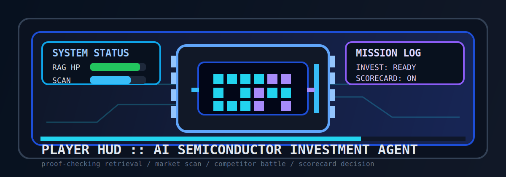
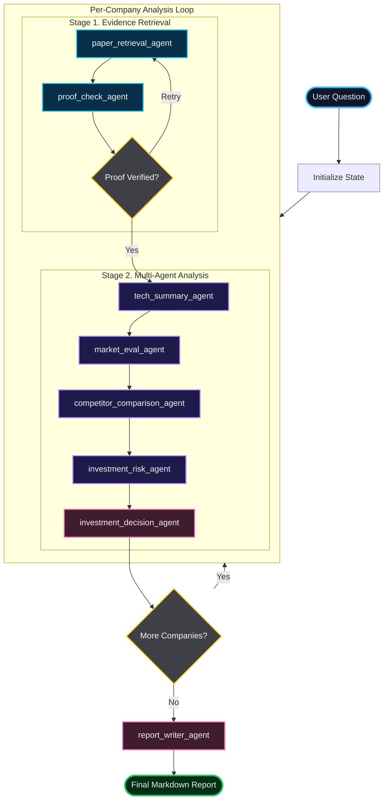
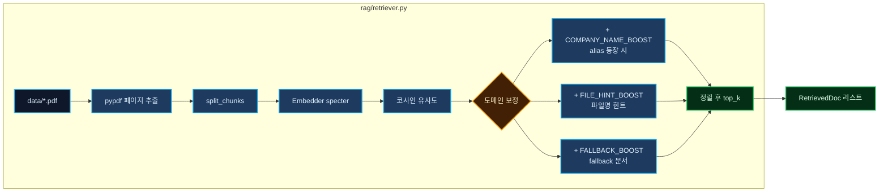
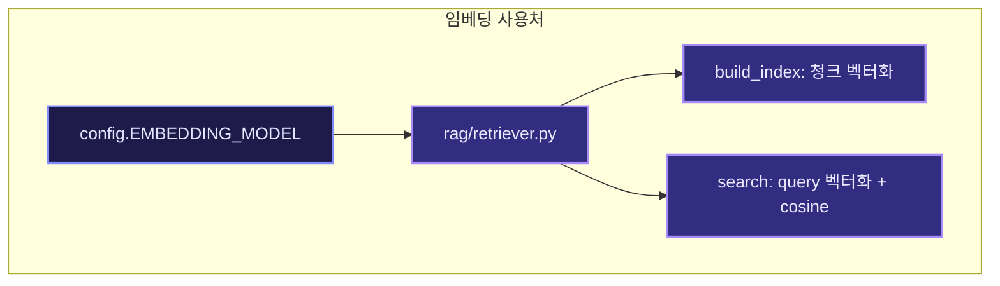
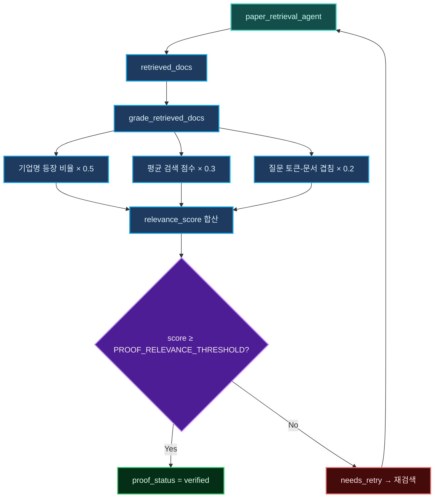
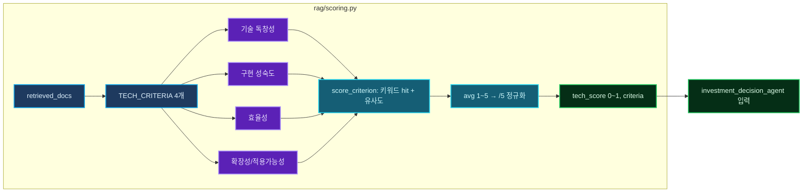
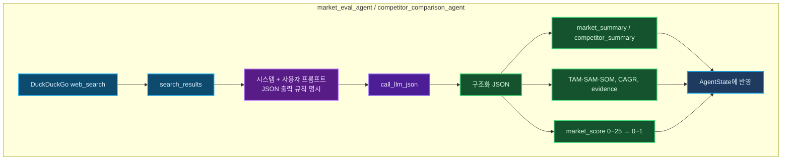
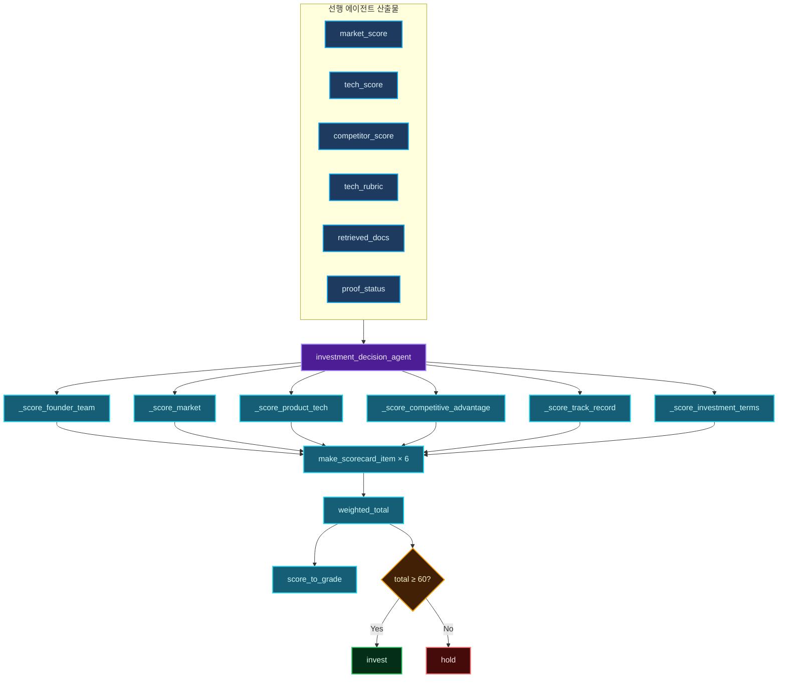
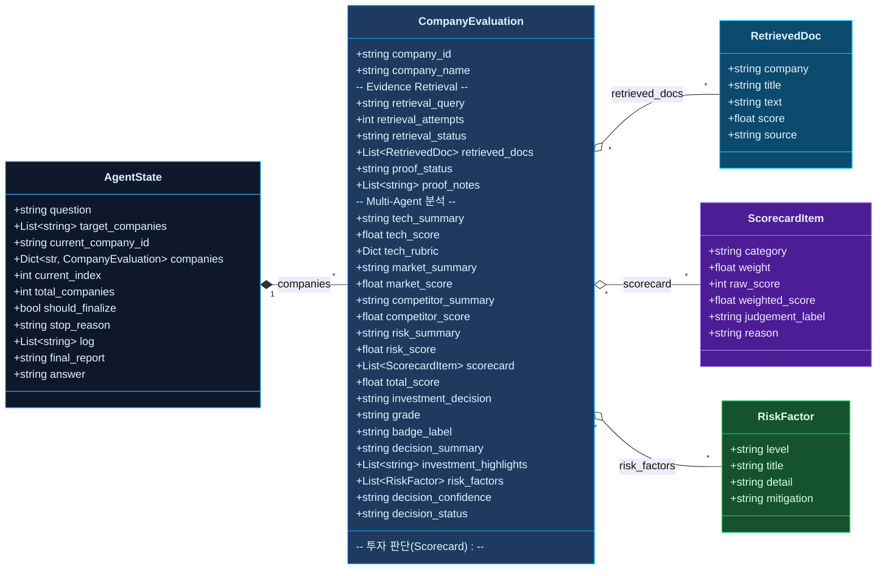

<div align="center">

<h1>AI Semiconductor Startup Investment Agent</h1>

<p>
  <strong>RAG 기반 증거 회수</strong> + <strong>멀티 에이전트 분석</strong> + <strong>투자 판단 보고서 자동 생성</strong>
</p>

<p>
  
  
  
  
  
</p>




</div>

---

## 목차

1. [Overview](#1-overview)
2. [Why This Project](#2-why-this-project)
3. [Features](#3-features)
4. [Tech Stack](#4-tech-stack)
5. [Agents](#5-agents)
6. [Architecture](#6-architecture)
7. [RAG Impact](#7-rag-impact)
8. [Core Technical Highlights](#8-core-technical-highlights)
9. [State Design](#9-state-design)
10. [Example Output Flow](#10-example-output-flow)
11. [Contributors](#11-contributors)

---

## 1. Overview

> **문서를 읽고, 근거를 검증하고, 투자 판단까지 연결하는 반도체 스타트업 평가 에이전트**
>
> 이 프로젝트는 PDF 기술 문서와 웹 검색 결과를 활용해 AI 및 반도체 스타트업의 **기술력, 시장성, 경쟁 구도, 리스크**를 단계별로 분석하고, 최종적으로 **투자 유망(INVEST) / 보류(HOLD) / 회피** 수준의 종합 의견을 마크다운 보고서 형태로 자동 생성합니다. 단순 요약이 아니라 RAG로 회수한 근거를 검증한 뒤, 각 에이전트가 점수와 요약을 쌓고, Scorecard 방식으로 투자 판단을 내리는 구조입니다.

| 구분 | 내용 |
|------|------|
| **Objective** | AI 스타트업의 기술력, 시장성, 리스크 등을 기준으로 투자 적합성 분석 |
| **Method** | AI Agent + Agentic RAG (증거 회수 → 검증 → 다중 에이전트 분석 → 보고서 생성) |
| **Tools** | PDF RAG 검색, Proof Check 검증, LLM과 웹 검색 기반 구조화 분석 |

## 2. Why This Project

반도체 스타트업 투자는 일반 SaaS 스타트업과 같은 프레임으로 보기 어렵습니다. 기술 차별성만으로는 부족하고, 실제 심사에서는 다음 질문을 동시에 다뤄야 합니다. 기술이 정말 차별적인가, 시장이 충분히 큰가, 경쟁 우위가 유지되는가, 상용화와 고객 도입 가능성은 있는가, 자본 집약적인 산업 구조에서 투자해도 되는가 등입니다. 이 프로젝트는 이런 질문을 각각 전담 에이전트에게 나누어 맡기고, RAG로 확보한 문서 근거와 웹 검색 결과를 바탕으로 점수와 요약을 쌓은 뒤, 마지막에 **투자 심사 문서 형태로 통합**합니다. 그래서 "왜 이 프로젝트인가"에 대한 답은, 단일 모델 요약이 아니라 **근거, 검증, 분석, 판단이 연결된 파이프라인**을 만들기 위함이라고 정리할 수 있습니다.

## 3. Features

본 시스템이 제공하는 핵심 기능은 세 가지로 정리할 수 있습니다. 첫째, **PDF 자료 기반 정보 추출**으로, IR 자료, 기사, 백서 등 `data/*.pdf`를 임베딩 검색해 질의와 기업에 맞는 근거 청크를 회수합니다. 둘째, **투자 기준별 판단 분류**로, 시장성, 팀(창업자), 기술력, 경쟁 우위, 리스크 등을 전용 에이전트가 나누어 평가하고, 점수와 요약을 상태에 누적합니다. 셋째, **종합 투자 요약 출력**으로, Scorecard Valuation Method에 따라 6개 항목의 가중 점수를 합산해 **INVEST / HOLD / 회피** 판단을 내리고, 기업별 상세와 비교가 포함된 마크다운 보고서를 자동 생성합니다.

| 포인트 | 설명 |
|--------|------|
| `문서 기반 판단` | 감이 아니라 PDF 근거 청크를 회수한 뒤 판단합니다. |
| `검증 가능한 RAG` | 검색 결과를 바로 믿지 않고 `proof_check_agent`가 관련성을 점검합니다. |
| `투자 프레임워크 연결` | 기술 요약에서 끝나지 않고 Scorecard 방식으로 최종 의견을 냅니다. |
| `보고서 자동 생성` | 최종 출력이 마크다운 보고서라 발표/공유/데모에 바로 활용 가능합니다. |

## 4. Tech Stack

| Category   | Details                      |
|------------|------------------------------|
| Framework  | LangGraph, LangChain, Python |
| LLM        | GPT-4o-mini via OpenAI API   |
| Retrieval  | FAISS, Chroma                |
| Embedding  | multilingual-e5-large        |

> **현재 구현**: 상태 기반 파이프라인(`state.py`, `main.py`)으로 동작하며, 임베딩은 `allenai-specter`를 사용합니다. Retrieval은 메모리 내 벡터 검색(`rag/retriever.py`)으로 구현되어 있습니다.

## 5. Agents

역할 기준으로 보면, **기술 경쟁력 평가** 계열(기술 요약, 루브릭 점수, 경쟁사 비교, 리스크 분석)은 `tech_summary_agent`, `competitor_comparison_agent`, `investment_risk_agent`가 담당하고, **시장 및 팀 평가** 계열(시장성 JSON 평가, 팀/실적/투자조건 반영)은 `market_eval_agent`와 `investment_decision_agent`의 Scorecard 로직이 담당합니다. 증거 회수 단계에서는 `paper_retrieval_agent`가 PDF 청크를 검색하고, `proof_check_agent`가 관련성을 검증하며, 최종 보고서는 `report_writer_agent`가 생성합니다. 아래 표에 파일 경로와 역할을 정리했습니다.

| Agent | 파일 | 역할 |
|--------|------|------|
| Retrieval Agent | `agents/paper_retrieval_agent.py` | 질문과 기업명을 바탕으로 PDF 청크 검색 |
| Proof Check Agent | `agents/proof_check_agent.py` | 검색 근거 관련성 검증 및 재시도 제어 |
| Tech Summary Agent | `agents/tech_summary_agent.py` | 기술 요약, 기술 점수, 루브릭 생성 |
| Market Eval Agent | `agents/market_eval_agent.py` | 웹 검색 결과를 바탕으로 시장성 JSON 평가 |
| Competitor Comparison Agent | `agents/competitor_comparison_agent.py` | 경쟁 구도, 해자, 대체 위협 분석 |
| Investment Risk Agent | `agents/investment_risk_agent.py` | 리스크 요인과 리스크 점수 계산 |
| Investment Decision Agent | `agents/investment_decision_agent.py` | Scorecard 점수, 등급, 최종 투자 의견 산출 |
| Report Writer Agent | `agents/report_writer_agent.py` | 기업별 상세 보고서 + 비교 보고서 생성 |

## 6. Architecture

현재 구현은 LangGraph 등 외부 그래프 엔진 없이, `state.py`와 `main.py`를 중심으로 한 **상태 기반 멀티 에이전트 파이프라인**으로 동작합니다. 사용자 질문과 대상 기업 목록이 주어지면, 기업별로 RAG 단계(검색 → 검증)를 거친 뒤 기술, 시장, 경쟁, 리스크, 투자판단, 보고서 작성 순으로 에이전트가 실행되며, 모든 중간 결과는 `AgentState`에 누적됩니다.



### 핵심 설계 포인트

- `paper_retrieval_agent`: PDF 문서를 임베딩 검색해 관련 청크를 회수합니다.
- `proof_check_agent`: 검색 결과가 질문/기업과 관련 있는지 점검하고, 부족하면 재검색합니다.
- `tech_summary_agent`: 기술 루브릭 기반으로 기술력 요약과 점수를 만듭니다.
- `market_eval_agent`: 웹 검색 + LLM JSON 출력으로 시장성을 구조화합니다.
- `competitor_comparison_agent`: 경쟁사/대체 기술/하이퍼스케일러 위협을 분석합니다.
- `investment_risk_agent`: 시장/경쟁/기술/근거 부족 리스크를 종합합니다.
- `investment_decision_agent`: Scorecard Valuation Method 기반 종합 점수, 등급, 투자 의견을 산출합니다.
- `report_writer_agent`: 결과를 발표용 마크다운 보고서로 렌더링합니다.

## 7. RAG Impact

### 왜 RAG가 중요했는가

RAG는 기업 내부 및 외부 문서를 질의와 연결해 목적에 맞는 정확한 답변을 생성하는 현실적인 방법으로 널리 쓰입니다. 이 프로젝트에서는 그 개념을 그대로 가져와, **기술 문서 기반 증거를 먼저 확보한 뒤** 그 위에 투자 판단을 쌓도록 설계했습니다. PDF에서 검색만 하고 끝내지 않고, proof_check_agent로 관련성을 한 번 더 검증하기 때문에, “검색 결과를 그대로 믿지 않고 의심하는 구조”가 RAG의 가치를 높입니다. 그 결과 기술 문서의 구조적 차별성, 구현 성숙도, 효율성, 경쟁 우위 근거가 강화되고, 단순 생성형 요약이 아니라 **기업별 점수와 우선순위를 다시 정렬하는 투자 평가 시스템**으로 동작하게 됩니다.

### 강조할 성과

| 순위 | 기업 | 종합 점수 | 판단 |
|---:|---|---:|---|
| 1 | Rebellions | **71.7** | INVEST |
| 2 | FuriosaAI | **69.3** | INVEST |
| 3 | Mobilint | **60.9** | INVEST |

| 핵심 변화 포인트 | 최신 결과 |
|---|---|
| 최우선 투자 검토 대상 | **Rebellions** |
| 최고 경쟁 우위 점수 | **Rebellions 80점** |
| 가장 보수적 해석 기업 | **Mobilint** |
| 발표용 메시지 | **RAG 근거 구성에 따라 투자 우선순위가 실제로 재정렬됨** |

즉, 이 시스템은 그냥 요약하는 것이 아니라, PDF 문서에서 근거를 다시 끌어오고, 그 근거가 충분한지 검증한 뒤, 실제 투자 우선순위 자체를 다시 정렬한다는 점이 RAG Impact의 요지입니다.

---

## 8. Core Technical Highlights

### 1. PDF RAG Retrieval

`rag/retriever.py`는 `data/*.pdf`를 읽어 페이지 단위 텍스트를 청킹하고, `allenai-specter` 임베딩으로 벡터화한 뒤 코사인 유사도로 검색합니다. 여기서 그치지 않고, 반도체 도메인에 맞게 **점수 보정**이 들어갑니다. 기업 alias가 문서에 등장하면 해당 청크 점수를 올리고, 파일명 힌트(예: 기업명이 포함된 파일)가 있으면 추가 가산을 주며, fallback 문서가 검색될 때도 소량의 가산을 둡니다. 그래서 단순 유사도 검색이 아니라 **도메인 힌트를 반영한 검색기**로 동작합니다.



### 2. Embedding Model Benchmark

이 프로젝트는 현재 `allenai-specter`를 사용하고 있으며, 이후 README에 **임베딩 모델 벤치마크 결과**를 추가할 수 있도록 아래 틀을 미리 마련해두었습니다.

#### 현재 적용 모델

| 항목 | 내용 |
|---|---|
| Production Model | `allenai-specter` |
| 적용 위치 | `rag/retriever.py`, `config.py` |
| 선택 이유 | 기술 문서/논문 성격의 PDF 검색에 맞춘 문서 임베딩 |

#### 추후 벤치마크 기록용 표

| 모델 | Retrieval Precision | Top-k Recall | 응답 품질 체감 | 속도 | 비용 | 비고 |
|---|---:|---:|---|---|---|---|
| `allenai-specter` | TBD | TBD | TBD | TBD | TBD | 현재 적용 모델 |
| `bge-m3` | TBD | TBD | TBD | TBD | TBD | 비교 후보 |
| `multilingual-e5-large` | TBD | TBD | TBD | TBD | TBD | 비교 후보 |
| `jina-embeddings-v3` | TBD | TBD | TBD | TBD | TBD | 비교 후보 |

#### 벤치마크 작성 메모

- 반도체 기술 문서 질의 기준 `Top-k` 검색 정확도 비교
- 기업명 alias 매칭 전/후 성능 비교
- 한국어 질의와 영문 PDF 혼합 환경에서의 일관성 비교
- 최종 투자 보고서 품질에 미치는 영향까지 함께 기록 예정



### 3. Retrieval Proof Check

`agents/utils.py`의 `grade_retrieved_docs()`는 검색 결과가 질의와 기업이 얼마나 맞는지 세 가지를 합산해 신뢰도를 판단합니다. 기업명이 실제 문서에 얼마나 등장하는지, 평균 검색 점수는 어떤지, 질문 토큰과 문서 내용의 겹침 정도는 어떤지입니다. 이 점수가 설정된 임계값보다 낮으면 재검색을 시도합니다. 그래서 이 프로젝트는 "검색했다"에서 끝나지 않고 **검색 결과를 한 번 더 의심하는 구조**를 갖습니다.




### 4. Technical Rubric Scoring

`rag/scoring.py`는 기술력을 네 가지 기준으로 1~5점 스케일로 평가합니다. 기술 독창성(구조적 차별성), 구현 성숙도(실칩, 제품, 데모, SDK 등), 효율성(성능, 전력, 메모리), 확장성 및 적용 가능성(LLM, 비전, 엣지, 서버 등)입니다. 각 항목은 `config.py`의 TECH_CRITERIA에 질문과 키워드가 매핑되어 있고, 이 값은 0~1로 정규화된 뒤 투자 판단 단계의 핵심 입력(tech_score, 루브릭 세부)으로 사용됩니다.



### 5. Web + LLM Structured Analysis

시장성과 경쟁사 분석은 `DuckDuckGo` 검색 결과를 수집한 뒤, LLM에게 **JSON 포맷을 강제하는 프롬프트**로 넘겨 구조화합니다. 그래서 결과가 자유 서술이 아니라 시장 요약, CAGR, TAM-SAM-SOM 관련 정보, 경쟁사 및 하이퍼스케일러 위협, evidence 배열, confidence/status 같은 필드로 나오며, 후속 에이전트가 그대로 파싱해 점수와 요약에 반영할 수 있습니다.



### 6. Investment Scorecard

최종 판단은 `config.py`의 가중치와 `investment_decision_agent.py` 로직을 사용해 계산됩니다. 각 평가 항목은 선행 에이전트의 산출물(점수, 요약, 검증 상태)을 입력으로 받으며, 아래 표에 **매칭 에이전트**를 함께 적었습니다. 창업자/팀과 실적은 단일 에이전트가 아니라 문서 수, proof 상태, 기술 루브릭(구현 성숙도) 등을 종합해 추정하고, 투자조건은 현재 파이프라인에 기업가치, 지분율 데이터가 없어 보수적 고정값을 씁니다. 이 점수는 단순 평균이 아니라 반도체 스타트업 특성을 고려한 **보정형 Scorecard Valuation Method**입니다.

| 평가 항목 | 비중 | 가중 만점 | 에이전트 기여 |
|-----------|------|-----------|----------------|
| 창업자/팀 | 30% | 최대 **30점** | tech_summary(기술 루브릭), paper_retrieval(문서 수), proof_check(검증) → 하나의 raw_score를 만든 뒤 × 30% |
| 시장성 | 25% | 최대 **25점** | market_eval_agent 한 명이 market_score × 25% |
| 제품/기술력 | 15% | 최대 **15점** | tech_summary_agent 한 명이 tech_score × 15% |
| 경쟁 우위 | 10% | 최대 **10점** | competitor_comparison_agent 한 명이 competitor_score × 10% |
| 실적 | 10% | 최대 **10점** | paper_retrieval(문서 수), proof_check(검증), tech_summary(구현 성숙도) → 하나의 raw_score × 10% |
| 투자조건 | 10% | **5.5점** (고정) | 입력 없어 investment_decision_agent가 raw 55 고정 × 10% |



## 9. State Design

이 프로젝트의 중심은 `state.py`에 정의된 **AgentState**입니다. 모든 에이전트는 독립 실행체라기보다, 이 상태를 읽고 업데이트하는 함수형 노드로 구성되어 있어, 기업별로 검색, 검증, 기술, 시장, 경쟁, 리스크, 판단, 보고서 단계가 진행되는 동안 중간 산출물이 한 곳에 누적됩니다.



### 주요 상태 구조

- `question`: 사용자의 투자 질의
- `target_companies`: 분석 대상 기업 목록
- `current_company_id`: 현재 처리 중인 기업
- `companies`: 기업별 분석 결과 저장소
- `log`: 각 단계 실행 로그
- `final_report`: 최종 마크다운 보고서

기업별로는 다음 정보가 누적됩니다.

- 검색 쿼리, 검색 시도 횟수, 검색 문서
- proof 상태
- 기술/시장/경쟁/리스크 요약 및 점수
- scorecard
- 최종 등급과 투자 의견

이 구조 덕분에 파이프라인이 길어져도 **중간 산출물을 추적하고 재사용하기 쉽습니다.**

---

## 10. Example Output Flow

```text
질문 입력
  -> 기업별 PDF 근거 검색
  -> 검색 근거 검증 및 재시도
  -> 기술 요약 및 점수화
  -> 시장성 평가
  -> 경쟁사 비교
  -> 리스크 계산
  -> Scorecard 투자 판단
  -> 최종 비교 보고서 출력
```

<details>
<summary><strong><a href="REPORT.md">샘플 마크다운 보고서 펼쳐보기</a></strong></summary>

전체 샘플 보고서는 [REPORT.md](REPORT.md)에서 확인할 수 있습니다.

</details>

## 11. Contributors

|  |  |  |
|:---:|:---:|:---:|
| [](https://github.com/JunSeo2001) | [](https://github.com/suhyenim) | [](https://github.com/woos-choi) |
| 김준서 ([JunSeo2001](https://github.com/JunSeo2001)) | 임수현 ([suhyenim](https://github.com/suhyenim)) | 최우석 ([woos-choi](https://github.com/woos-choi)) |
| 멀티 에이전트 구축 <br> State 설계 <br> 투자 분석 및 보고서 생성 에이전트 설계 | 프롬프트 엔지니어링 <br> 시장 분석 및 경쟁사 분석 에이전트 설계 <br> | 임베딩 모델 설계 및 데이터 전처리 <br> RAG 구축 <br> 기술 요약 에이전트 설계 |

---

<div align="center">

### Built for evidence-grounded startup investing

<sub>PDF를 읽고, 근거를 검증하고, 투자 판단을 생성하는 Agentic RAG 시스템</sub>

</div>